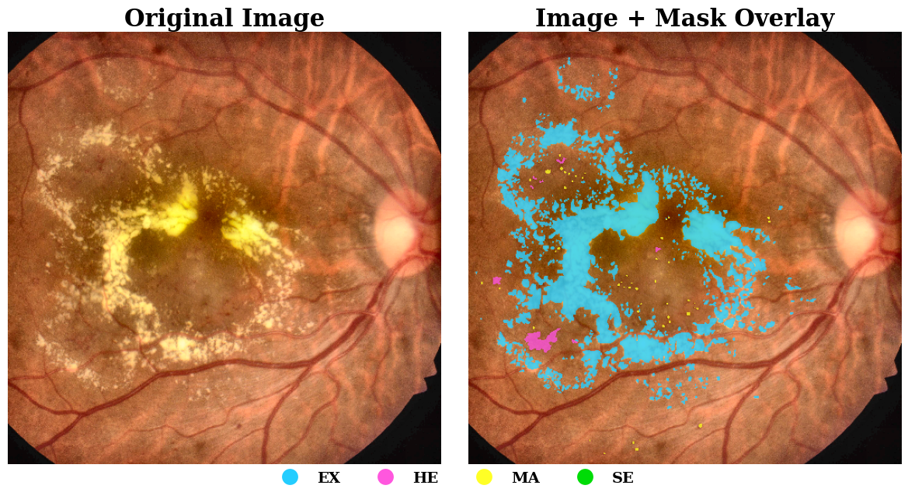
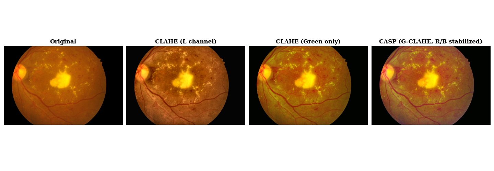
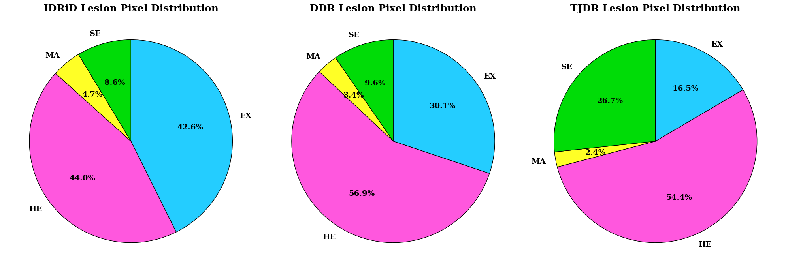

# **Preprocessing and Training Techniques for Enhancing Microaneurysm Segmentation in Fundus Imaging @ WAT.ai**

### Overview

This repository contains work in progress on the **semantic segmentation of microaneurysms, hemorrhages, soft exudates, and hard exudates** (lesions resulting from Diabetic Retinopathy) from fundus images. In addition to building the full segmentation pipeline, the project also conducts experimentation on techniques for enchancing the detection of microaneurysms. 

---

### Research Focus
This project investigates techniques for improving microaneurysm segmentation in diabetic retinopathy fundus images, where lesions are extremely small and often low-contrast relative to surrounding tissue. In particular, we focus on:
- **Contrast enhancement strategies** to improve lesion visibility, including channel-specific preprocessing and local contrast normalization (CLAHE).
- **Training-time techniques** to improve sensitivity to small structures, including loss functions designed to emphasize microaneurysm recall.

---

### Project Status/Progress
- [x] Dataset Curation 
- [x] Preprocessing and Augmentation Pipelines
- [x] Loss Function Development 
- [x] Data Visualizations
- [x] CMAC-Net Implementation in PyTorch
- [x] Training Scripts 
- [ ] Part 1: Baseline Training
- [ ] Part 2: Preprocessing Variation Analysis
- [ ] Part 3: Class Imbalance Aware Loss Function Analaysis
- [ ] Part 4: Explicit Scalar Reweighting of Per-Class Loss Analysis
- [ ] Get results on testing sets
- [ ] Publish research paper!

---

### Model
The segmentation architecture used in this project is based directly on the original research paper that introduced it. 
* **CMAC-Net** Paper: [CMAC-Net: Cascade Multi-Scale Attention Convolution Network for diabetic retinopathy lesion segmentation](https://www.sciencedirect.com/science/article/pii/S1746809425009954?via%3Dihub) 

Additionally, a full dynamic implementations of CMAC-Net can be found in this repository.

---

### Datasets
Three datasets are chosen for the project. All datasets contain fundus images and segmentation masks for microaneuryms, hemorrhages, soft exudates, and hard exudates. The IDRiD and DDR datasets contain the masks in the binary form. The TJDR dataset contains the masks as a image with color mappings.
* **IDRiD**: [Indian Diabetic Retinopathy Dataset from Kaggle](https://www.kaggle.com/dataset/saaryapatel98/indian-diabetic-retinopathy-image-dataset)
* **DDR**: [Diabetic Retinopathy Lesion Segmentation and Lesion Detection Dataset from GitHub](https://github.com/nkicsl/DDR-dataset/tree/master)
* **TJDR**: [TJDR: A High-Quality Diabetic Retinopathy Pixel-Level Annotation Dataset from GitHub](https://github.com/NekoPii/TJDR)

Dataset Pixel Distributions by Class

---

### References
