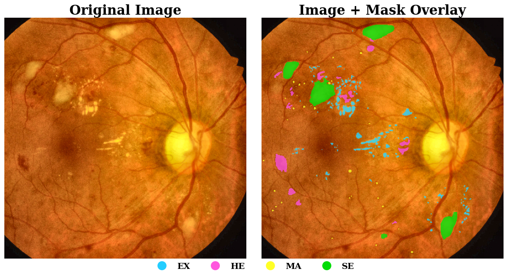

# **Techniques for Enhancing Small Lesion Segmentation in Diabetic Retinopathy Fundus Images Using CMAC-Net @ WAT.ai**

### Overview
This repository contains work in progress on the **semantic segmentation of microaneurysms, hemorrhages, soft exudates, and hard exudates** (lesions resulting from Diabetic Retinopathy) from fundus images. In addition to building the full segmentation pipeline, the project also conducts a on techniques for enchancing the detection of microaneurysms. 
---

### Model
The segmentation architecture used in this project is based directly on the original research papers that introduced it. 
* **CMAC-UNet** Paper: [CMAC-Net: Cascade Multi-Scale Attention Convolution Network for diabetic retinopathy lesion segmentation](https://www.sciencedirect.com/science/article/pii/S1746809425009954?via%3Dihub)

Additionally, full dynamic implementations of both models can be found in this repository.

### Datasets
Three datasets are chosen for the project. All datasets contain fundus images and segmentation masks. The IDRiD dataset contains masks for microaneurysms, hemorrhages, soft exudates, hard exudates, and the optic disc (discarded). The DDR dataset contains the same. The TJDR dataset also contains the same. 
* **IDRiD**: [Indian Diabetic Retinopathy Dataset from Kaggle](https://www.kaggle.com/dataset/saaryapatel98/indian-diabetic-retinopathy-image-dataset)
* **DDR**: [Diabetic Retinopathy Lesion Segmentation and Lesion Detection Dataset from GitHub](https://github.com/nkicsl/DDR-dataset/tree/master)
* **TJDR**: [TJDR: A High-Quality Diabetic Retinopathy Pixel-Level Annotation Dataset from GitHub](https://github.com/NekoPii/TJDR)

---

### References
